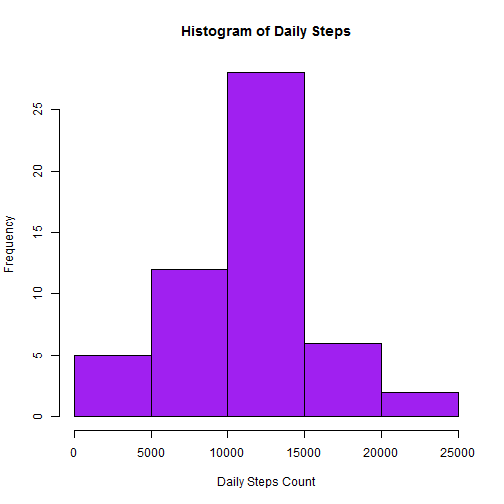
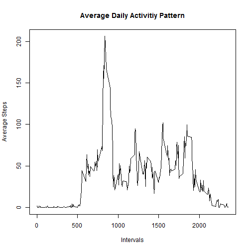
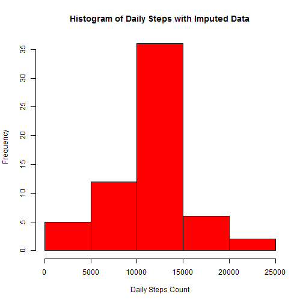

## Activity Monitoring Data
### Peer Assessment I
#### Loading and preprocessing the data  
1. Load the data.  
2. Process/transform the data.  

```r
	act <- read.csv("activity.csv", header=T)
	act$date <- as.Date(act$date, "%Y-%m-%d")
```

#### What is mean total number of steps taken per day?
1. Make a histogram of the total number of steps taken each day.  
2. Report the mean and median total number of steps taken per day.  

```r
	byday <- aggregate(steps ~ date, data = act, sum, na.remove=T)
	hist(byday$steps, col="purple", 
		main="Histogram of Daily Steps", 
		xlab="Daily Steps Count")
```

 

```r
	mean1 <- mean(byday$steps)
	median1 <- median(byday$steps)
```
The mean total number of steps taken per day is 1.0767189 &times; 10<sup>4</sup>.  
The median total number of stetps taken per day is 10766.

#### What is the average daily activity pattern?  
1. Make a time series plot of the 5-minute interval and 
the average number of steps taken, averaged across all days (y-axis).   
2. Which 5-minute interval, on average across all the days in the dataset, 
contains the maximum number of steps?  

```r
	byinterval <- aggregate(steps ~ interval, data = act, mean, na.remove=T)
	plot(byinterval$interval, byinterval$steps, type="l",
		main = "Average Daily Activitiy Pattern",
		xlab = "Intervals",
		ylab = "Average Steps")
```

 

```r
	max <- byinterval$interval[which(byinterval$step == max(byinterval$steps))]
```
The interval containing the maxinum number of steps is 835.

#### Imputing missing values  

1. Calculate and report the total number of missing values.  
2. Devise a strategy for filling in all of the missing values.    
3. Create a new dataset with the missing data filled in.  
4. Make a histogram of the total number of steps taken each day; 
report the mean and median total number of steps taken per day. 
Do these values differ from the estimates from Part I of the assignment? 
What is the impact of imputing missing data on the estimates?

```r
	act2 <- act	
	totalMissing <- sum(is.na(act2$steps))
	missing <- which(is.na(act$steps))

	# To impute the missing data, I replace the missing numbers of steps
	# with the average numbers of steps by intervals.  

	for(i in seq(missing)){
		# x is an interval with a missing value for steps  
		x <- act2$interval[missing[i]]
		# n is the position in the "byinterval" table where x is found   
		n <- which(byinterval$interval == x)
		act2$steps[missing[i]] <- byinterval$steps[n]
	}
	byday2 <- aggregate(steps ~ date, data = act2, sum)
	hist(byday2$steps, col="red", 
		main="Histogram of Daily Steps with Imputed Data", 
		xlab="Daily Steps Count")
```

 

```r
	mean2 <- mean(byday2$steps)
	median2 <- median(byday2$steps)
```
The total number of missing values is 2304.  
The mean total number of steps by day in the imputed dataset is 1.0766189 &times; 10<sup>4</sup>.  
The median total number of steps by day in the imputed dataset is 1.0766189 &times; 10<sup>4</sup>.  
They are different from the first part of the assignment.  
The impact of imputing missing data have changed both the mean and median.  

#### Are there differences in activity patterns between weekdays and weekends?
1. Create a new factor variable with two levels -- "weekday" and "weekend".  
2. Make a panel plot containing a time series plot of the 5-minute interval
and the average number of steps taken, averaged across all weekdays/weekends.  

```r
	day <- weekdays(act2$date)
	act3 <- cbind(act2, day)
	day <- gsub("Monday", "Weekday", day)
	day <- gsub("Tuesday", "Weekday", day)
	day <- gsub("Wednesday", "Weekday", day)
	day <- gsub("Thursday", "Weekday", day)
	day <- gsub("Friday", "Weekday", day)
	day <- gsub("Saturday", "Weekend", day)
	day <- gsub("Sunday", "Weekend", day)
	act3$day <- day
	act3 <- transform(act3, day = factor(day))
	byweekday <- aggregate(steps ~ interval + day, data = act3, mean)
	# library(lattice) is needed fot this step  
	xyplot(steps ~ interval | day, data = byweekday, type = "l", 
		xlab = "Interval", ylab = "Number of steps", layout = c(1,2))
```

 
